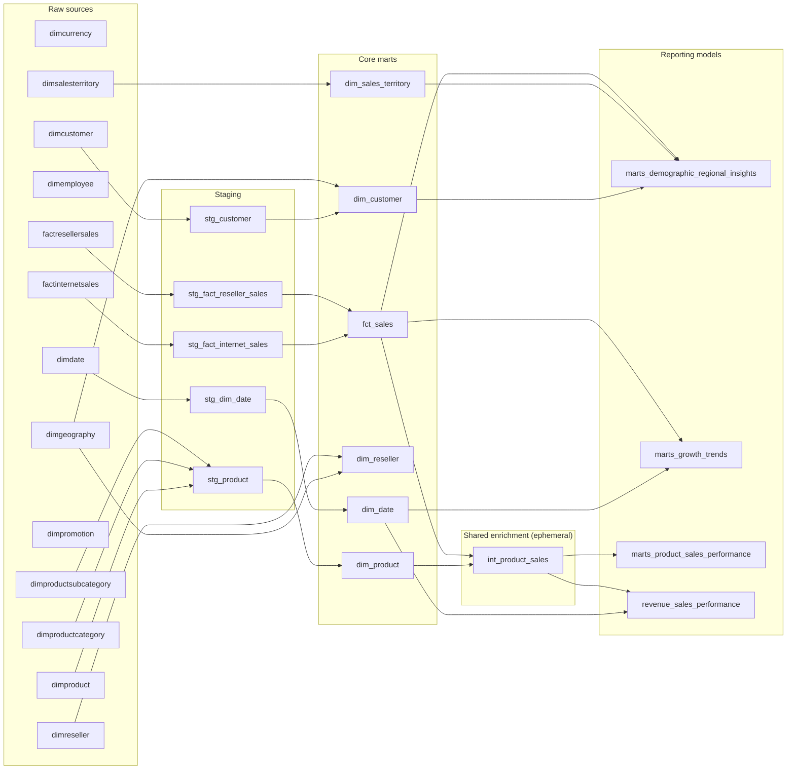

# Model lineage

Generated from a locally parsed dbt manifest on 2026-10-02. Arrows show SQL build
dependencies, excluding test-only references. This is source-code lineage, not proof
that the current warehouse relations have been rebuilt.

Registered sources without model edges are retained for validation or future use.
`int_product_sales` is compiled into each consumer, not materialized as a table.

## Model inventory

Schema values below reflect the selected local profile; profile schemas can differ
between environments. Ephemeral models have no warehouse relation.

| Model | Materialization | Schema | Direct SQL inputs |
| --- | --- | --- | --- |
| dim_customer | table | gold_adventureworks | dimgeography, stg_customer |
| dim_date | table | gold_adventureworks | stg_dim_date |
| dim_product | table | gold_adventureworks | stg_product |
| dim_reseller | table | gold_adventureworks | dimgeography, dimreseller |
| dim_sales_territory | table | gold_adventureworks | dimsalesterritory |
| fct_sales | table | gold_adventureworks | stg_fact_internet_sales, stg_fact_reseller_sales |
| int_product_sales | ephemeral | — (no relation) | dim_product, fct_sales |
| marts_demographic_regional_insights | table | gold_adventureworks | dim_customer, dim_sales_territory, fct_sales |
| marts_growth_trends | view | silver_adventureworks | dim_date, fct_sales |
| marts_product_sales_performance | table | gold_adventureworks | int_product_sales |
| revenue_sales_performance | table | gold_adventureworks | dim_date, int_product_sales |
| stg_customer | view | silver_adventureworks | dimcustomer |
| stg_dim_date | view | silver_adventureworks | dimdate |
| stg_fact_internet_sales | table | silver_adventureworks | factinternetsales |
| stg_fact_reseller_sales | table | silver_adventureworks | factresellersales |
| stg_product | view | silver_adventureworks | dimproduct, dimproductcategory, dimproductsubcategory |

## Reporting joins

| Fact field | Dimension field | Notes |
| --- | --- | --- |
| product_key | dim_product.product_key | Historical version key; finished goods only. Shared enrichment uses a left join to retain unmatched sales. |
| order_date_key | dim_date.date_key | Order-date role. |
| customer_key | dim_customer.customer_key | Internet channel. |
| reseller_key | dim_reseller.reseller_key | Reseller channel. |
| sales_territory_key | dim_sales_territory.sales_territory_key | Preserved from both staged facts; used by demographics. |

Fact relationship tests do not mean the fact SQL joins those dimensions. The diagram
does include the actual joins performed by shared enrichment and reporting models.

## Reporting changes

- `marts_product_sales_performance` replaces `marts_product_inventory_analytics`
  at product-key/channel grain. The old warehouse relation requires separate retirement.
- The monthly revenue model retains its existing grain and now shares product enrichment.
- Growth remains a profile-schema view because its SQL is outside `models/marts/`.
- Product-key coverage tests flag unknown dimension matches without removing sales.

See [reporting grains and validation](PROJECT_GUIDE.md) and
[product sales migration and metric rules](PRODUCT_SALES.md).

## Refresh

Regenerate this snapshot after dependency changes. For the interactive graph, use
the [offline documentation workflow](PROJECT_GUIDE.md#selective-rebuilds-and-offline-documentation)
or `dbt docs generate --static` for a warehouse-backed catalog.
