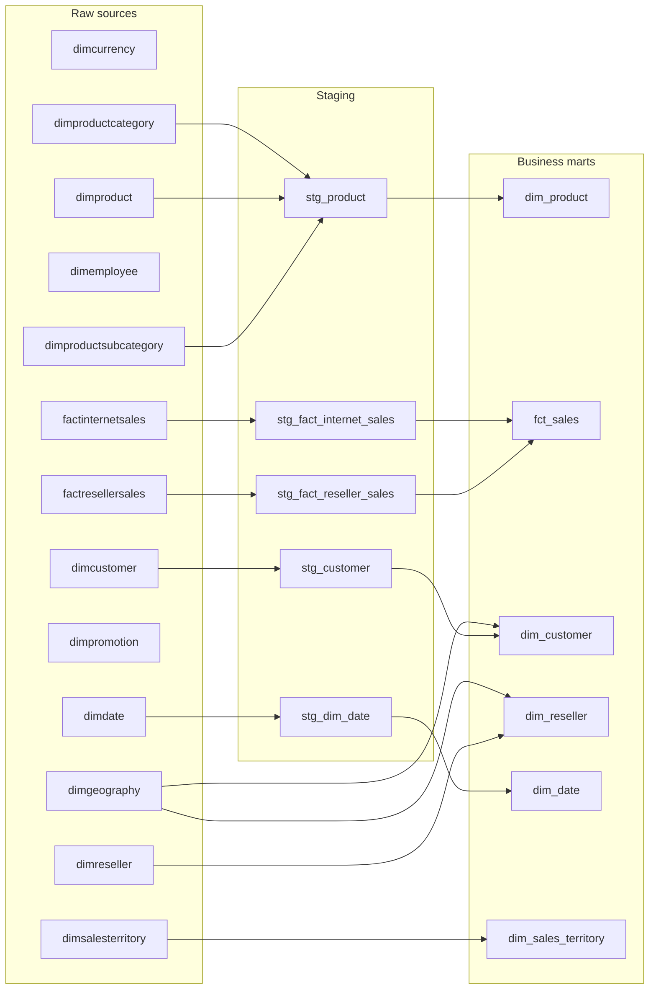

# Model lineage

Generated from the dbt manifest on 2026-10-02. Arrows show SQL build dependencies; test-only references and reporting joins are excluded.

Some raw sources have no model edge: they are registered for validation or future use. Source and relationship tests remain visible in the interactive dbt graph.

## Model inventory

| Model | Materialization | Schema | Direct inputs |
| --- | --- | --- | --- |
| dim_customer | table | gold_adventureworks | dimgeography, stg_customer |
| dim_date | table | gold_adventureworks | stg_dim_date |
| dim_product | table | gold_adventureworks | stg_product |
| dim_reseller | table | gold_adventureworks | dimgeography, dimreseller |
| dim_sales_territory | table | gold_adventureworks | dimsalesterritory |
| fct_sales | table | gold_adventureworks | stg_fact_internet_sales, stg_fact_reseller_sales |
| stg_customer | view | silver_adventureworks | dimcustomer |
| stg_dim_date | view | silver_adventureworks | dimdate |
| stg_fact_internet_sales | table | silver_adventureworks | factinternetsales |
| stg_fact_reseller_sales | table | silver_adventureworks | factresellersales |
| stg_product | view | silver_adventureworks | dimproductcategory, dimproduct, dimproductsubcategory |

## Reporting joins

These are logical reporting joins, not dbt build edges.

| Fact field | Dimension field | Notes |
| --- | --- | --- |
| product_key | dim_product.product_key | Join by version key, not repeated product_id; mart contains finished goods only. |
| order_date_key | dim_date.date_key | Order-date role. |
| customer_key | dim_customer.customer_key | Internet channel. |
| reseller_key | dim_reseller.reseller_key | Reseller channel. |

`fct_sales` does not expose sales_territory_key, so it has no direct join to `dim_sales_territory`. Its current referential tests point to staging dimensions or raw reseller, rather than these mart dimensions.

## Refresh

Regenerate the interactive graph with `dbt docs generate --static`. Update this diagram if model dependencies change.
